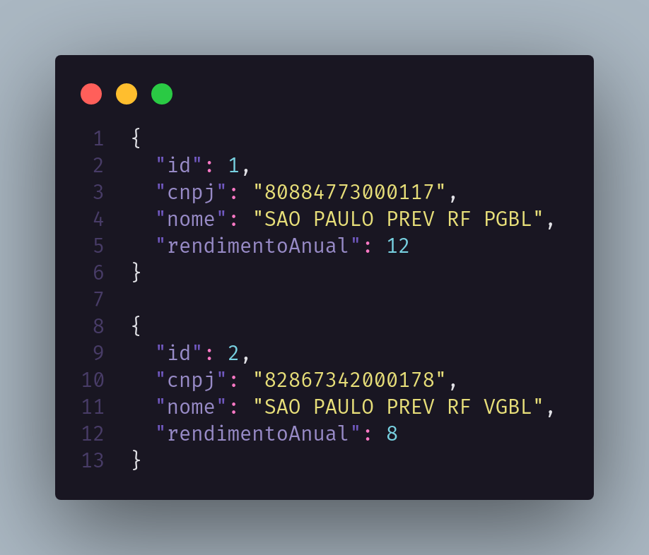
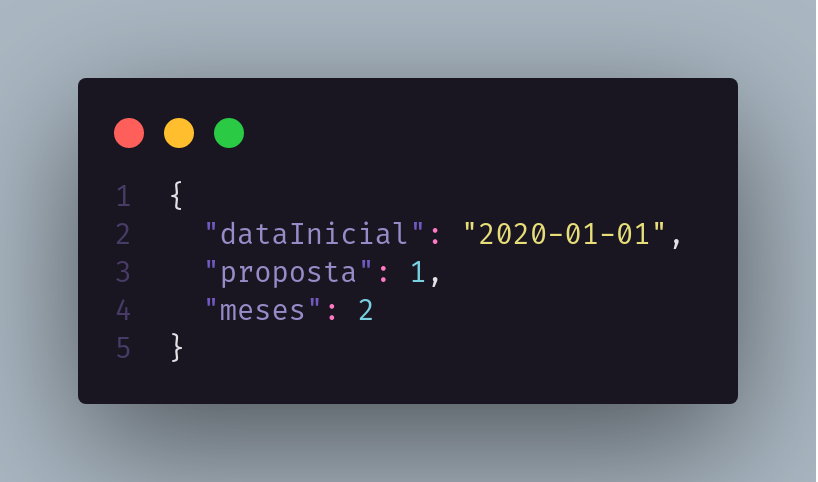
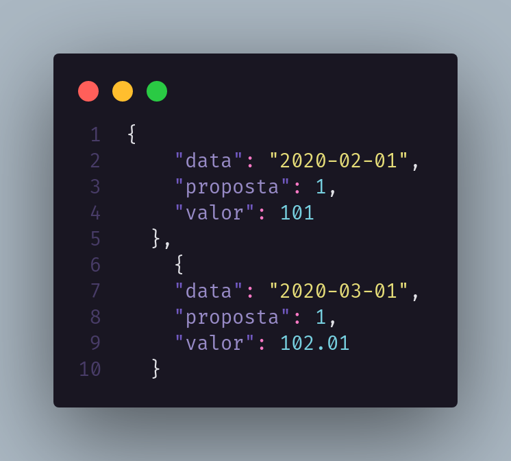

<h1 align="center">EQI Back-End</h1>

<h2 align="center">Status da API</h1>
<h4 align="center">
	🚧 API Backend 🚀 Finalizada...✅
</h4>

<h1 align="center">
  
  
</h1>

<p align="center">
 <a href="#Objetivo">Objetivo</a> •
 <a href="#Features">Features</a> •
 <a href="#Tecnologias">Tecnologias</a> •
 <a href="#Instruções">Instruções</a>
</p>

<h1 align="center">Objetivo</h1>

<p align="center">
A Eu Quero Investir oferece assessoria a seus clientes, desde a montagem da carteira de investimentos, até o acompanhamento da rentabilidade. Para isso disponibiliza para seus assessores um sistema para auxiliar e acompanhar seus clientes. Para essa tarefa você deve criar uma API simplificada que recebe requests para criação de clientes, propostas e para consultar a projeção de rendimentos. Você não deve se preocupar com o frontend da aplicação.
</p>

# Features

- [x] Cadastro de assessores.
- [x] Cadastro de clientes (somente assessores).
- [x] Cadastro de propostas (somente assessores).
- [x] Listagem de clientes para determinado assessor.
- [x] Listagem de clientes específicos pelo seu ID.
- [x] Listagem de propostas (somente assessores).
- [x] Projeção de rendimentos calculada com juros compostos (somente assessores).

# Tecnologias

- NodeJS
- MySQL
- Express
- Insomnia
- DBeaver

# Instruções

### Passo 1:
```
$ git clone https://github.com/viniciussaturnino/apiNode_EQI
```
### Passo 2:
```
$ cd apiNode_EQI
```
### Passo 3:
```
$ yarn
```
### Passo 4:
```
$ yarn dev
```

# Fundos disponíveis



<!-- ```json
{
  "id": 1,
  "cnpj": "80884773000117",
  "nome": "SAO PAULO PREV RF PGBL",
  "rendimentoAnual": 12
}

{
  "id": 2,
  "cnpj": "82867342000178",
  "nome": "SAO PAULO PREV RF VGBL",
  "rendimentoAnual": 8
}
``` -->

<h2 >Input rendimentos (2 meses)</h2>

<p>valor da proposta: 100
id do fundo usado: 1</p>



<!-- ```json
{
  "dataInicial": "2020-01-01",
  "proposta": 1,
  "meses": 2
}

``` -->

<h2 >Output rendimentos (2 meses)</h2>



<!-- ```json
[
  {
    "data": "2020-02-01",
    "proposta": 1,
    "valor": 101
  },
    {
    "data": "2020-03-01",
    "proposta": 1,
    "valor": 102.01
  }
]
``` -->
